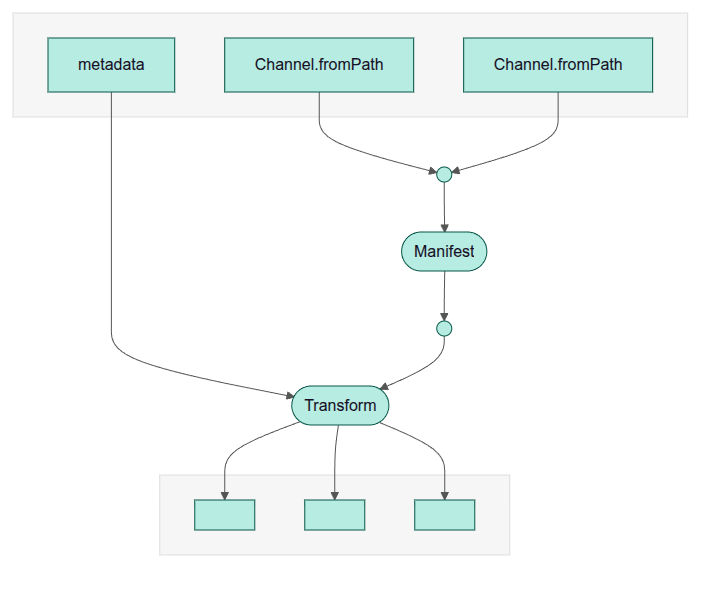

# QTLformer

Nextflow pipeline for qtl fine mapping transformation to gentropy format.
This pipeline allows to process the `eQTL Catalogue` fine-mapping results into the `gentropy` StudyIndex and StudyLocus formats.

## Dependencies

- Nextflow
- Google Cloud SDK
- Docker (testing)

## Flow

The pipeline has following steps:

1. Build manifest of fine-mapping results to be processed.
2. Transform the fine-mapping results into gentropy format.



## Usage

Check the execution in with the `test` profile. This configuration uses small test datasets stored in `testdata/susie` and `testdata/sumstats` folders.

```{bash}
nextflow run main.nf -profile test
```

To run the full pipeline, one configuration is implemented for Google Cloud.

```{bash}
nextflow run main.nf -profile googleCloud
```

Testing on google cloud sample

```{bash}
nextflow run main.nf -profile googleCloudTest
```

NOTE: Make sure to set up the dataset in the referenced cloud buckets before running the cloud test.

## Inputs

Pipeline expects the datasets to be in a follwing structure:

```{bash}
testdata/susie
└── QTS000001
    ├── QTD000001
    │   ├── QTD000001.credible_sets.parquet
    │   └── QTD000001.lbf_variable.parquet
    └── QTD000002
        ├── QTD000002.credible_sets.parquet
        └── QTD000002.lbf_variable.parquet

testdata/sumstats
└── QTS000001
    ├── QTD000001
    │   └── QTD000001.cc.parquet
    └── QTD000002
        └── QTD000002.cc.parquet
```

> [!NOTE]
> The pipeline expects the input datasets to be organized in the structure shown above.
> The `testdata/susie` folder is used for transformations.
> Summary statistics under `testdata/sumstats` are used just to extract the path to the summary statistics file for each dataset.
> which is later stored in the `StudyIndex` dataset.

## Outputs

```{bash}
testdata/output
├── manifest.tsv
├── pipeline_info
│   ├── execution_report
│   │   └── execution_report_2025-11-25_23-04-39.html
│   ├── execution_timeline
│   │   └── execution_timeline_2025-11-25_23-04-39.html
│   ├── execution_trace
│   │   └── execution_trace_2025-11-25_23-04-39.txt
│   └── pipeline_dag
│       └── pipeline_dag_2025-11-25_23-04-39.html
├── study_index
│   ├── QTD000001
│   │   ├── part-00000-3b01f93a-d726-4503-9562-3f7a9e0fe512-c000.snappy.parquet
│   │   └── _SUCCESS
│   └── QTD000002
│       ├── part-00000-d0c6c8e6-28e1-4745-a90b-c62576b33b0f-c000.snappy.parquet
│       └── _SUCCESS
└── study_locus
    ├── QTD000001
    │   ├── part-00000-d94cc26a-436c-4ca0-974d-0891bd5ab774-c000.snappy.parquet
    │   └── _SUCCESS
    └── QTD000002
        ├── part-00000-4fd76204-ca41-45b6-ba75-abee2c1c7ae0-c000.snappy.parquet
        └── _SUCCESS
```

### StudyIndex and StudyLocus datasets

Note that the `study_index` and `study_locus` folders contain parquet files, the files are saved under the `dataset_id` folders (QTD000001, QTD000002).

### Manifest

The `manifest.tsv` file contains the list of processed datasets.

### Pipeline_info

Metrics and reports from pipeline run

